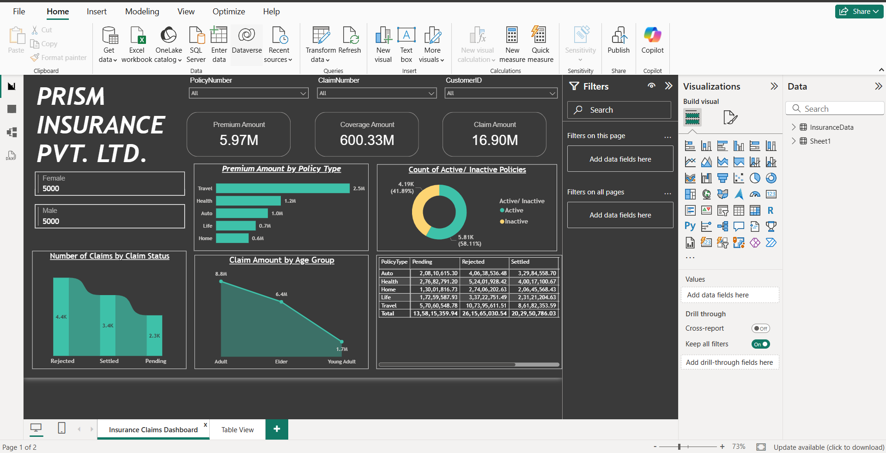
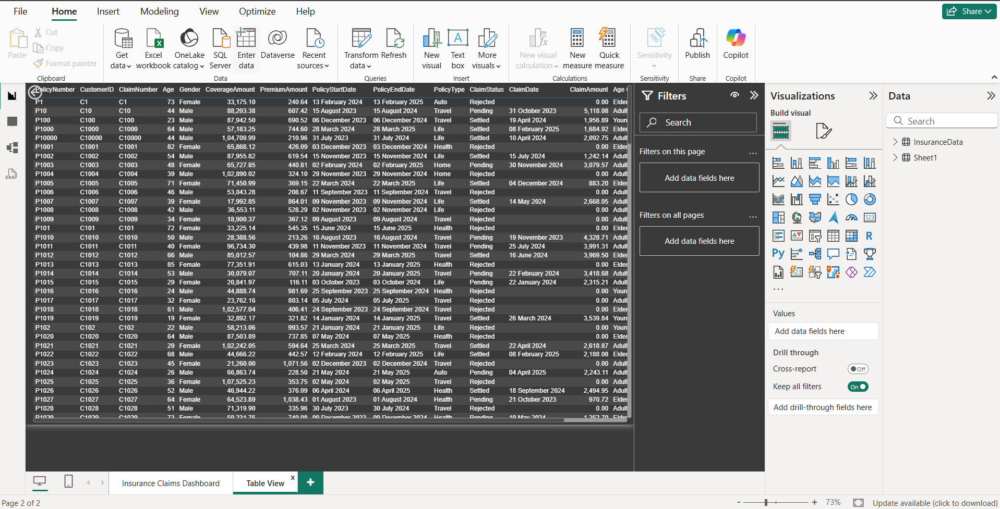

# 🛡️ Insurance Data Analysis

## 📌 Objective
Analyze insurance data to understand claim patterns, customer behavior, and key factors affecting insurance claims.

---

## 🛠️ Tools Used
- Power BI
- Excel

---

## 📂 Dataset
- Insurance dataset containing customer details, policy information, and claim records
- Includes attributes like age, charges, region, and claim status

---

## 📊 Key Insights
- Identified factors influencing insurance charges
- Analyzed claim distribution across different regions
- Observed patterns based on age and customer demographics
- Highlighted high-cost and low-cost customer segments

---

## 📸 Dashboard Preview

### 🔹 Insurance Dashboard Overview

### 🔹 Insurance Table View

---

## 🚀 Project Highlights
- Built an interactive Power BI dashboard for insurance analysis
- Used filters and slicers for dynamic exploration
- Visualized customer and claim data for better decision-making
- Performed data cleaning and preprocessing in Excel

---

## 📁 Files Included
- `InsuranceData.csv` → Raw dataset  
- `Insurance+Customer+Feedback.xlsx` → Additional dataset  
- `Insurance-Data-Analysis.pbix` → Power BI dashboard  

---

## 🔗 How to Use
1. Download the `.pbix` file  
2. Open in Power BI Desktop  
3. Interact with dashboard using filters and slicers  

---

## 💡 Learnings
- Understanding of insurance data and claim behavior  
- Data visualization techniques for business insights  
- Dashboard design and storytelling with data  
