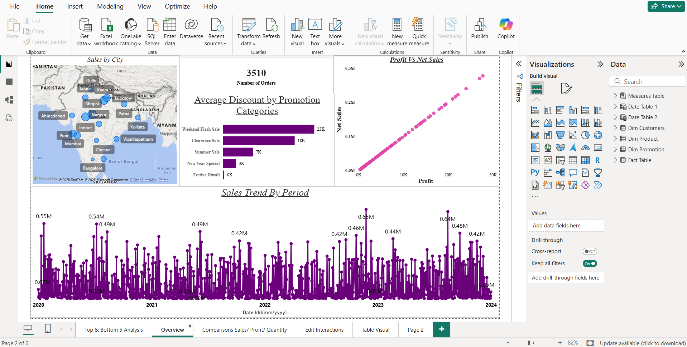
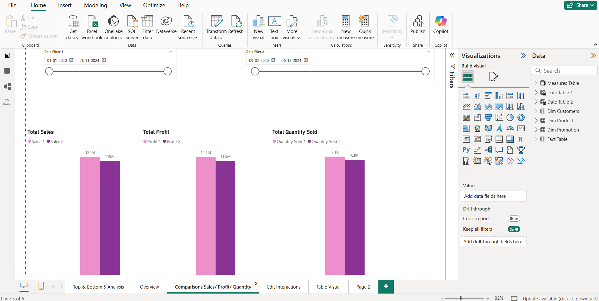
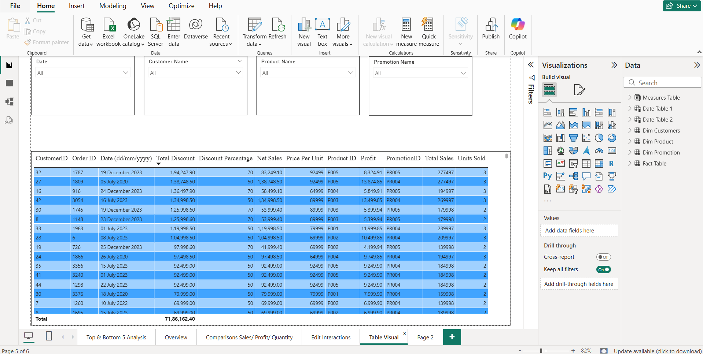
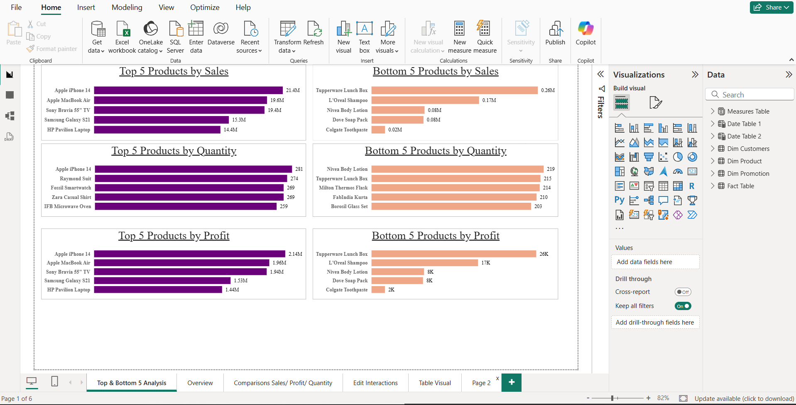

# 📊 Sales Data Analysis

## 📌 Objective
Analyze sales data to identify trends, top-performing products, and revenue insights.

---

## 🛠️ Tools Used
- Power BI
- Excel

---

## 📂 Dataset
- Sales dataset containing product, quantity, profit, and revenue details
- Source: Bootcamp project dataset

---

## 📊 Key Insights
- Identified top-performing products contributing to revenue
- Analyzed sales trends across time
- Found patterns in profit and quantity distribution
- Highlighted top & bottom performing products

---

## 📸 Dashboard Preview

### 🔹 Sales Overview

### 🔹 Sales, Profit & Quantity Comparison

### 🔹 Table Visual

### 🔹 Top & Bottom 5 Analysis

---

## 🚀 Project Highlights
- Built an interactive Power BI dashboard
- Used slicers and filters for dynamic analysis
- Visualized KPIs for business decision-making
- Applied data cleaning and transformation in Excel

---

## 📁 Files Included
- `Store+Data.xlsx` → Raw dataset  
- `Sales-Analysis-Dashboard.pbix` → Power BI dashboard  

---

## 🔗 How to Use
1. Download `.pbix` file
2. Open in Power BI Desktop
3. Explore dashboard using filters and slicers

---

## 💡 Learnings
- Data visualization best practices
- Business insight extraction
- Dashboard design techniques
