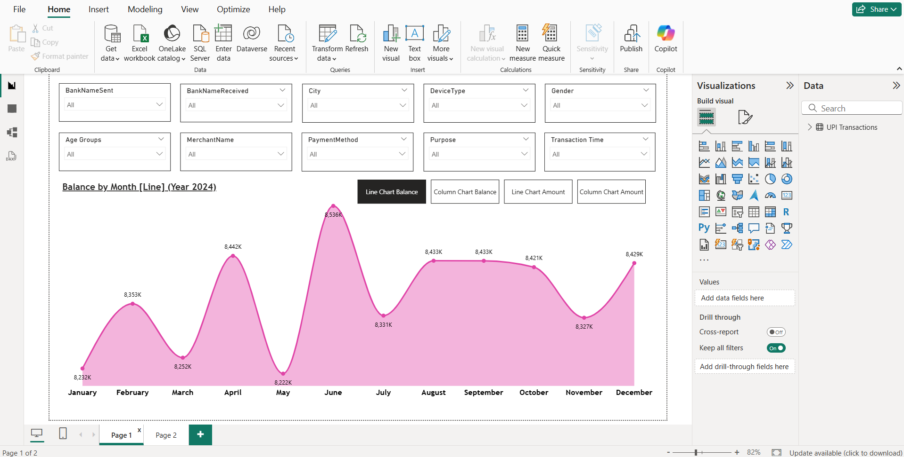
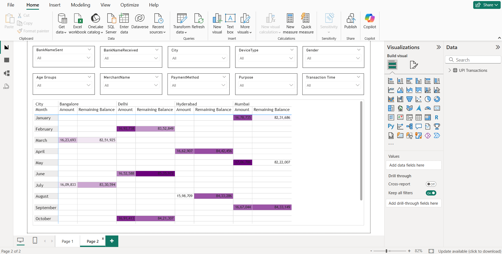

# 💳 UPI Transactions Data Analysis

## 📌 Objective
Analyze UPI transaction data to understand spending patterns, transaction behavior, and balance trends across different cities and categories.

---

## 🛠️ Tools Used
- Power BI
- Excel

---

## 📂 Dataset
- UPI transactions dataset containing transaction details such as amount, balance, city, bank, payment method, and purpose
- Includes attributes like device type, gender, and transaction time

---

## 📊 Key Insights
- Identified monthly trends in account balance and transaction amounts
- Analyzed city-wise transaction distribution and spending behavior
- Observed variations based on payment methods and transaction purposes
- Highlighted patterns in user activity across different demographics

---

## 📸 Dashboard Preview

### 🔹 Balance Trend (Monthly Analysis)

### 🔹 City-wise Transactions Table

---

## 🚀 Project Highlights
- Built an interactive Power BI dashboard for UPI transaction analysis
- Implemented multiple slicers (bank, city, device type, gender, etc.)
- Created dynamic visuals for trend analysis and comparison
- Designed a multi-page report for better data exploration

---

## 📁 Files Included
- `UPI+Transactions.xlsx` → Raw dataset  
- `UPI Transactions Data Analysis.pbix` → Power BI dashboard  

---

## 🔗 How to Use
1. Download the `.pbix` file  
2. Open in Power BI Desktop  
3. Use filters and slicers to explore insights  

---

## 💡 Learnings
- Understanding of digital payment data and user behavior  
- Advanced dashboard design in Power BI  
- Data storytelling using interactive visuals  
